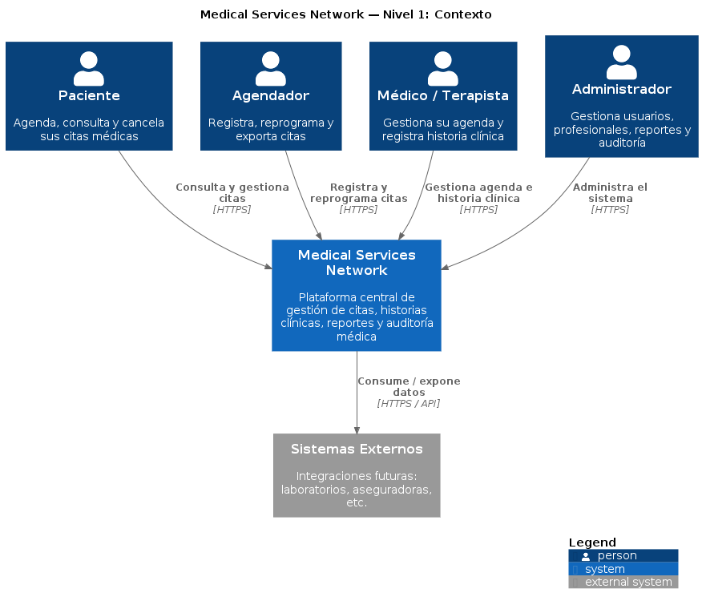
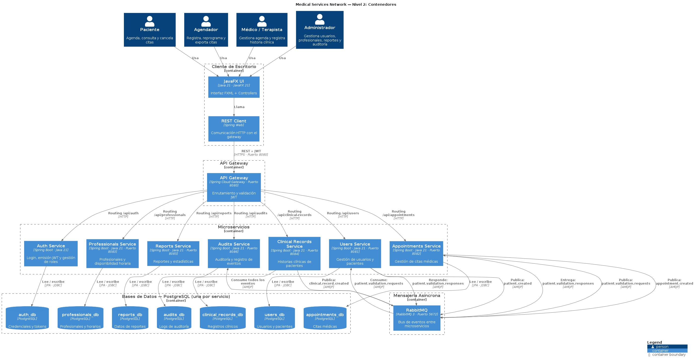
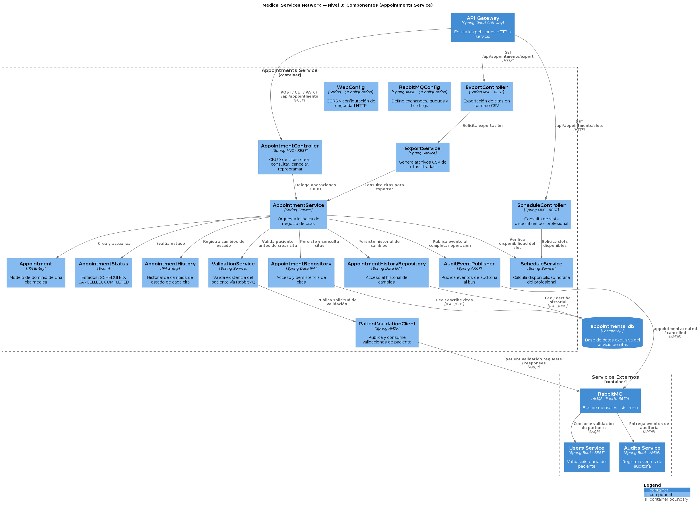

# C4 Model — Medical Services Network

## Overview

The C4 model documents the architecture of the Medical Services Network at four levels of abstraction. Each level provides a different perspective for different stakeholders.

| Level | Name | Audience | What It Shows |
|-------|------|----------|---------------|
| **L1** | Context | Everyone | System scope, users, and external dependencies |
| **L2** | Containers | Developers, Ops | High-level technology landscape (services, databases, queues) |
| **L3** | Components | Developers | Internal structure of a single service |
| **L4** | Code | Developers | Class-level design (see `docs/modeling/uml/`) |

---

## Level 1: System Context

Shows the Medical Services Network as a black box: who uses it and what external systems it interacts with.



### Actors

| Actor | Description |
|-------|-------------|
| **Paciente** | Books, views, and cancels medical appointments |
| **Agendador** | Registers, reschedules, and exports appointments on behalf of patients |
| **Médico / Terapista** | Manages schedule and records clinical history |
| **Administrador** | Manages users, professionals, reports, and audit |

### External Systems

| System | Description |
|--------|-------------|
| **Sistemas Externos** | Future integrations (laboratories, insurance, etc.) |

---

## Level 2: Containers

Shows the high-level technology landscape: the desktop client, API Gateway, microservices, message broker, and databases.



### Desktop Client

| Container | Technology | Responsibility |
|-----------|------------|----------------|
| **JavaFX UI** | Java 21 · JavaFX 21 | FXML-based desktop interface |
| **REST Client** | Spring Web | HTTP communication with API Gateway |

### API Gateway

| Container | Technology | Responsibility |
|-----------|------------|----------------|
| **API Gateway** | Spring Cloud Gateway · Port 8080 | Request routing, JWT validation |

### Microservices

| Service | Port | Responsibility |
|---------|------|----------------|
| **Auth Service** | — | Login, JWT issuance, role management |
| **Users Service** | 8081 | User and patient management |
| **Appointments Service** | 8082 | Medical appointment management |
| **Professionals Service** | 8083 | Professionals and schedule availability |
| **Clinical Records Service** | 8084 | Patient clinical history |
| **Reports Service** | 8085 | Reports and statistics |
| **Audits Service** | 8086 | Event logging and audit trail |

### Message Broker

| Container | Technology | Responsibility |
|-----------|------------|----------------|
| **RabbitMQ** | RabbitMQ 3 · Port 5672 | Async event bus between services |

### Databases

Each microservice has its own PostgreSQL database (database-per-service pattern).

| Database | Owner Service |
|----------|--------------|
| `auth_db` | Auth Service |
| `users_db` | Users Service |
| `appointments_db` | Appointments Service |
| `professionals_db` | Professionals Service |
| `clinical_records_db` | Clinical Records Service |
| `reports_db` | Reports Service |
| `audits_db` | Audits Service |

### Key Flows

**Synchronous (REST):**
```
Client → API Gateway → Microservice → Database
```

**Asynchronous (RabbitMQ):**
```
Service A → RabbitMQ → Service B
```

Example: patient validation on appointment creation:
```
Appointments Service → RabbitMQ (patient.validation.requests)
                      → Users Service (validates patient)
                      → RabbitMQ (patient.validation.responses)
                      → Appointments Service
```

---

## Level 3: Components (Appointments Service)

Shows the internal structure of the Appointments Service as a representative example. Other services follow a similar pattern.



### Architecture Layers

| Layer | Components | Responsibility |
|-------|-----------|----------------|
| **Controllers** | `AppointmentController`, `ScheduleController`, `ExportController` | HTTP entry points |
| **Services** | `AppointmentService`, `ValidationService`, `ScheduleService`, `ExportService` | Business logic |
| **Domain** | `Appointment`, `AppointmentStatus`, `AppointmentHistory` | Business entities |
| **Repositories** | `AppointmentRepository`, `AppointmentHistoryRepository` | Data access |
| **Messaging** | `PatientValidationClient`, `AuditEventPublisher` | Async communication |
| **Configuration** | `RabbitMQConfig`, `WebConfig` | Infrastructure setup |

---

## Level 4: Code

Code-level design is documented via PlantUML class and sequence diagrams at:

```
docs/modeling/uml/
```

See [docs/modeling/uml/INDEX.md](../docs/modeling/uml/INDEX.md) for the complete UML catalog.

---

## Diagram Sources

The source `.puml` files are located at:

```
docs/architecture/c4/
├── context_diagram.pump       ← Level 1: Context
├── containers_diagram.puml    ← Level 2: Containers
└── components_diagram.puml    ← Level 3: Components
```

### Regenerating

```bash
PLANTUML_JAR=~/.vscode-server/extensions/jebbs.plantuml-2.18.1/plantuml.jar
find docs/architecture/c4 -name "*.puml" -exec java -jar "$PLANTUML_JAR" -charset UTF-8 -tpng {} \;
```

---

## Related Documentation

| Document | Description |
|----------|-------------|
| `docs/architecture/system-overview.md` | System vision, requirements, and scope |
| `docs/modeling/uml/INDEX.md` | UML class and sequence diagrams |
| `ADRs/ADR-001-microservices-architecture.md` | Architecture decision record |
| `ADRs/ADR-005-spring-boot-for-microservices.md` | Container technology decision |
