# UML Diagrams — users-service

## 📁 Structure

The UML folder structure mirrors the Java package structure 1-to-1.

```
docs/modeling/uml/
├── INDEX.md                        # This file — entry point
├── example.puml                    # Reference style example
├── packages.puml                   # Package overview
├── diagrams/                       # Generated PNG diagrams
│   ├── PackagesOverview.png
│   ├── EntitiesRelations.png
│   ├── EnumUserRole.png
│   ├── DtoRelations.png
│   ├── FactoryRelations.png
│   ├── FactoryOperations.png
│   ├── ServiceRelations.png
│   ├── ServiceOperations.png
│   ├── ControllerRelations.png
│   ├── ControllerOperations.png
│   ├── RepositoryRelations.png
│   ├── MessengerRelations.png
│   ├── ConfigSecurity.png
│   ├── SequenceCreateUser.png
│   ├── SequencePatientValidation.png
│   ├── SequenceDeactivateUser.png
│   └── SequenceSearchUsers.png
├── entities/                       # com.medical.entities
│   └── 01-relations.puml           # User, Patient, Professional
├── enums/                          # com.medical.enums
│   └── 01-relations.puml           # UserRole
├── dto/                            # com.medical.dto
│   └── 01-relations.puml           # CreateUserRequest, UpdateUserRequest, UserResponse...
├── factory/                        # com.medical.factory
│   ├── 01-relations.puml           # IUserCreationStrategy + strategies + factory
│   └── 02-operations.puml          # Strategy + Factory methods
├── service/                        # com.medical.service
│   ├── 01-relations.puml           # UserService + dependencies
│   └── 02-operations.puml          # UserService methods
├── controller/                     # com.medical.controller
│   ├── 01-relations.puml           # UserController + dependencies
│   └── 02-operations.puml          # UserController endpoints
├── repository/                     # com.medical.repository
│   └── 01-relations.puml           # IUserRepository, IPatientRepository
├── messenger/                      # com.medical.messenger
│   └── 01-relations.puml           # PatientValidationListener
├── config/                         # com.medical.config
│   └── 01-relations.puml           # SecurityConfig
└── sequences/                      # Flow diagrams
    ├── 01-create-user.puml         # User creation with Strategy Pattern
    ├── 02-patient-validation.puml  # Async patient validation via RabbitMQ
    ├── 03-deactivate-user.puml     # User deactivation with admin guard
    └── 04-search-users.puml        # User search with JPA Specification
```

## 📋 Diagram Types

### Relations Diagrams (01-relations.puml)
- Show class structure and **relationships** between classes
- Include cardinalities and relationship names
- Include field definitions
- Packages referenced as external boxes where needed

### Operations Diagrams (02-operations.puml)
- Show **operations/methods** and attributes
- NO relationships between classes
- Only created when there is meaningful logic to document (Factory, Service, Controller)

### Sequence Diagrams
- Show **interaction flow** between components
- Include HTTP methods, service calls, DB queries
- Include notes explaining patterns and business rules

## 🎨 Color Conventions

| Color | Element | Meaning |
|-------|---------|---------|
| **#FFFACD** (LightYellow) | `<<entity>>` | JPA Entities |
| **#E0FFFF** (LightCyan) | `<<dto>>` | Data Transfer Objects |
| **#90EE90** (PaleGreen) | `<<service>>`, `<<strategy>>`, `<<factory>>`, `<<messenger>>` | Implementations |
| **#F0F8FF** (AliceBlue) | `<<interface>>` | Interfaces |
| **#87CEEB** (SkyBlue) | `<<controller>>` | REST Controllers |
| **#F5DEB3** (Wheat) | `<<configuration>>` | Configuration classes |
| **#B3D9FF** (LightBlue) | `<<enumeration>>` | Enums |
| **#F0F0F0** | Package | Package grouping / background |

## 🔗 Layer Flow

```
client → controller → service → factory → entities
                   ↓
              repository → DB (PostgreSQL)
```

## 🖼️ Diagramas Generados

### Package Overview
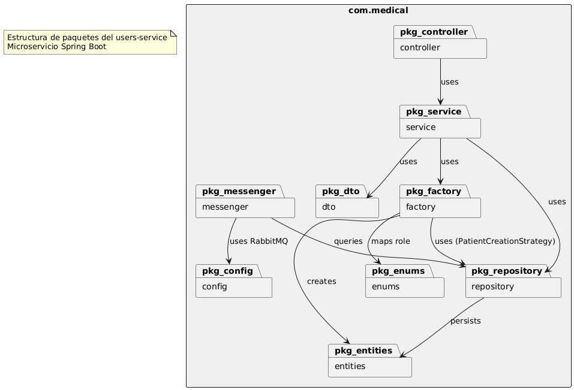

### Entities & Enums
| Entities | Enums |
|----------|-------|
| 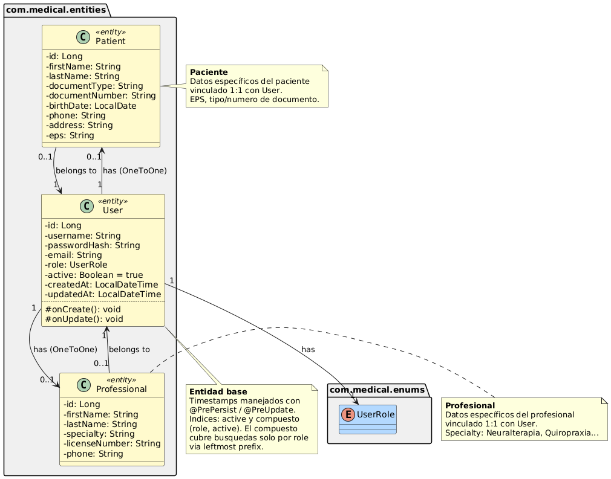 | 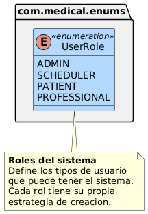 |

### DTOs & Factory
| DTOs | Factory (relations) | Factory (operations) |
|------|---------------------|----------------------|
| 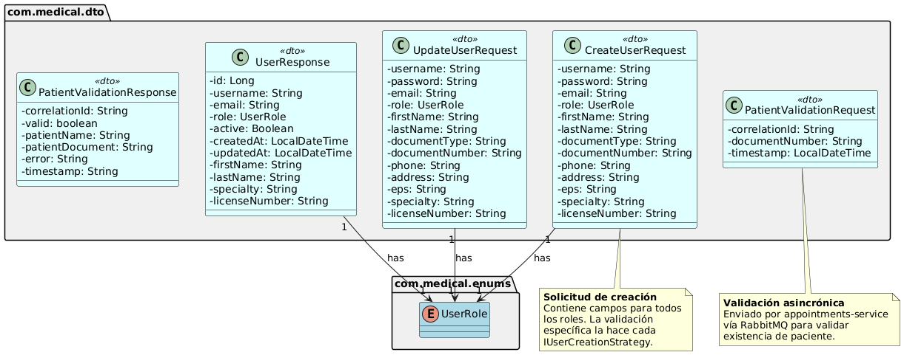 | 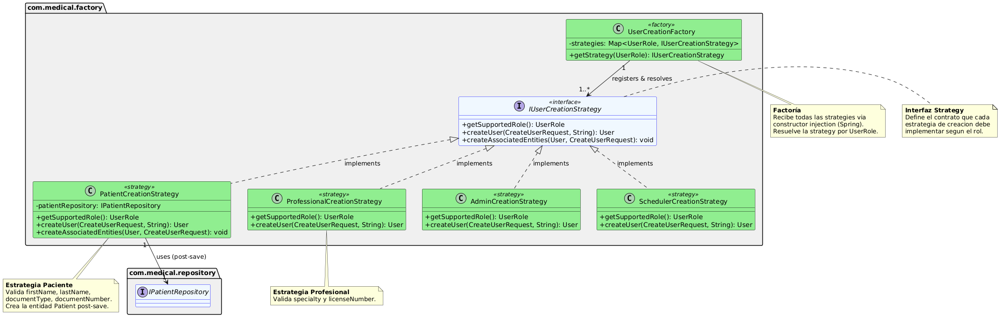 | 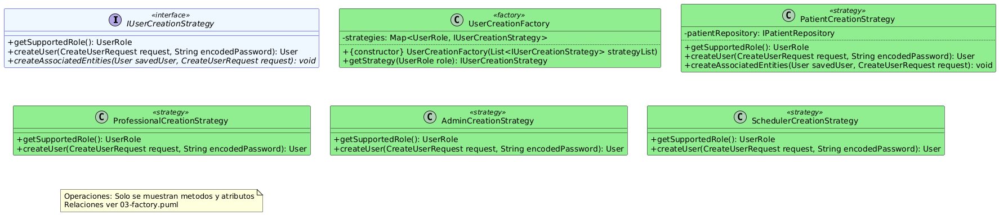 |

### Service & Controller
| Service (relations) | Service (operations) | Controller (relations) | Controller (operations) |
|---------------------|----------------------|------------------------|--------------------------|
| 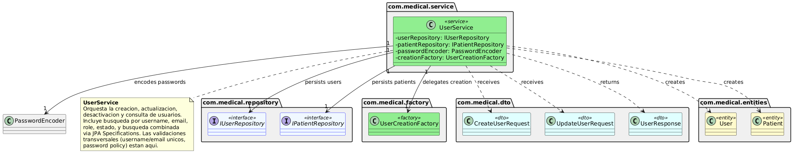 | 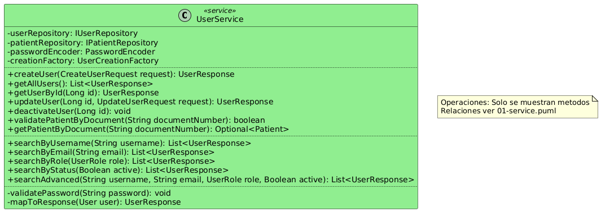 | 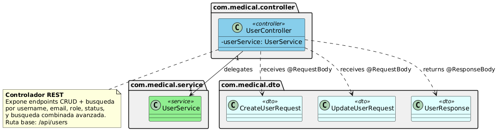 | 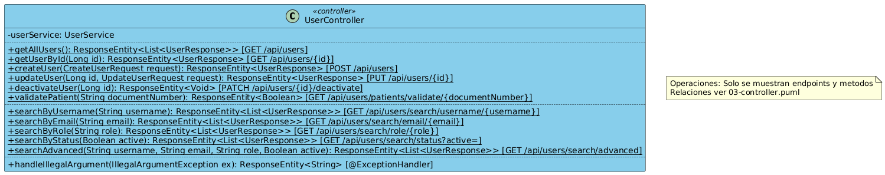 |

### Infrastructure
| Repositories | Messenger | Security Config |
|-------------|-----------|----------------|
| 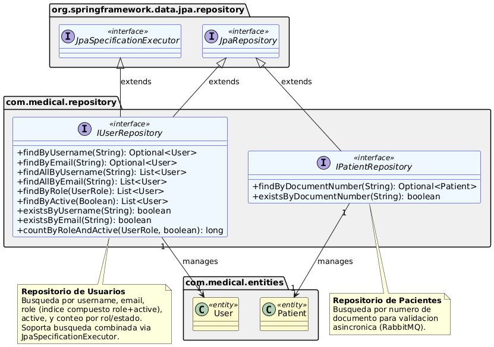 | 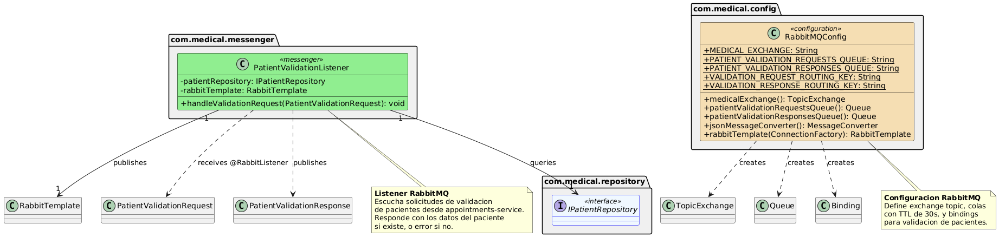 | 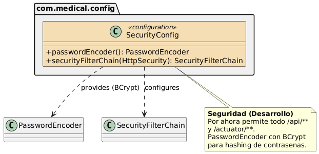 |

### Sequence Diagrams
| Create User (Strategy Pattern) | Patient Validation (RabbitMQ) | Deactivate User (Admin Guard) | Search Users |
|-------------------------------|-------------------------------|-------------------------------|--------------|
| 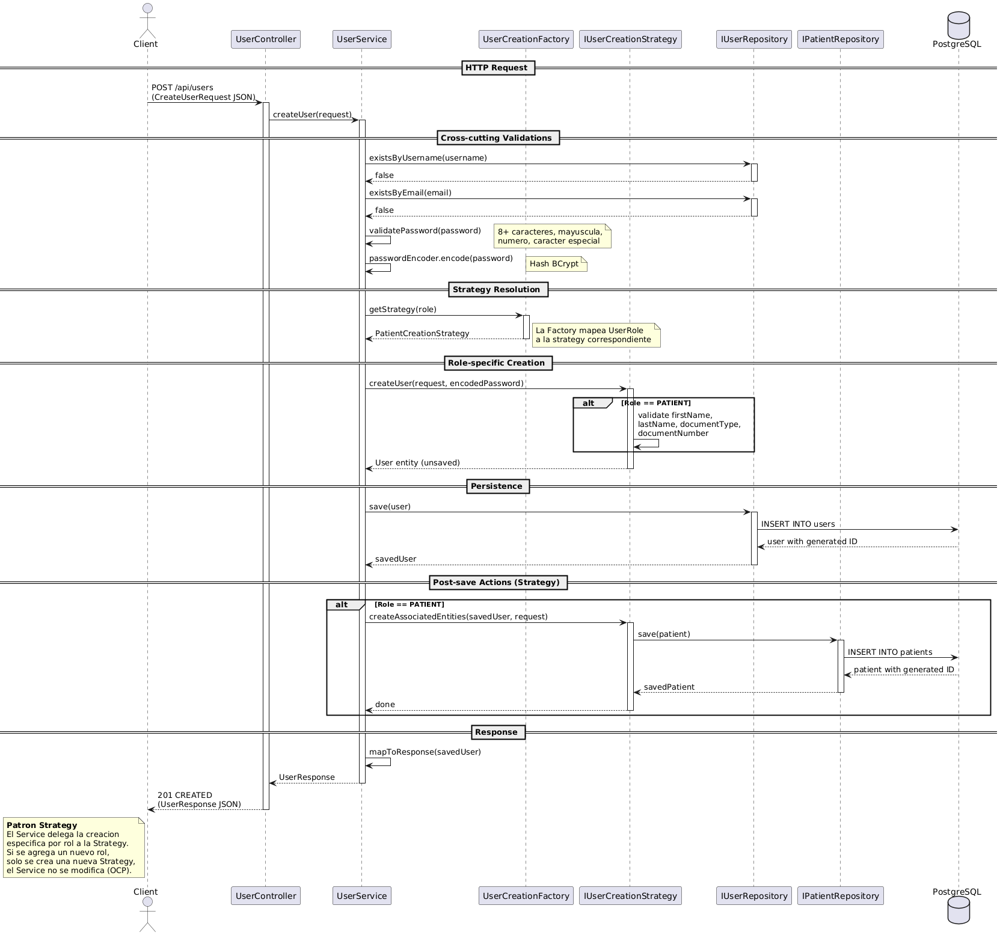 | 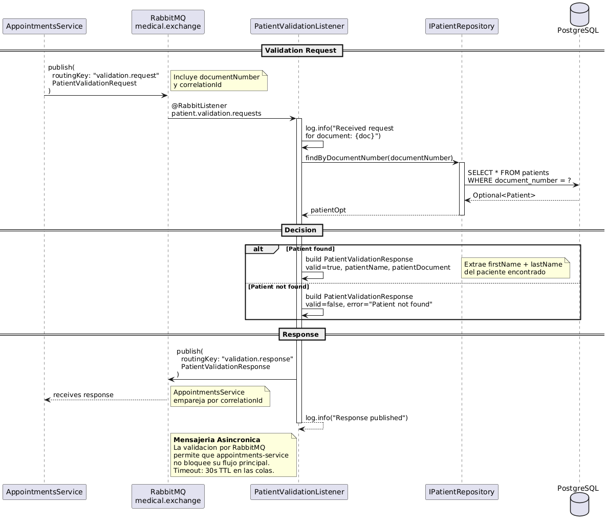 | 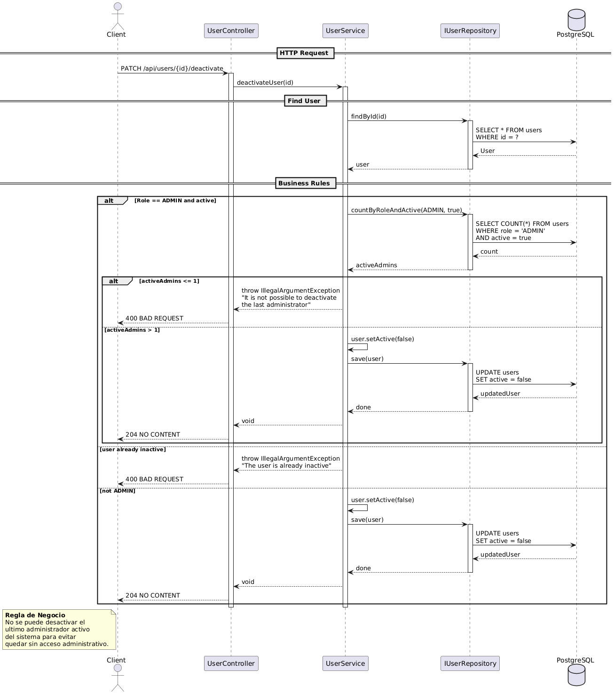 | 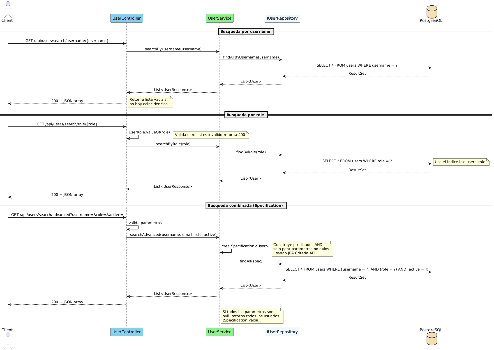 |

## 🖼️ Regenerar PNG

```bash
# From the users-service root
PLANTUML_JAR=~/.vscode-server/extensions/jebbs.plantuml-2.18.1/plantuml.jar
find docs/modeling/uml -name "*.puml" -not -path "*/diagrams/*" \
  -exec java -jar "$PLANTUML_JAR" -charset UTF-8 -tpng -o diagrams/ {} \;
```

## 📐 Design Patterns Applied

| Pattern / Principle | Where | UML |
|--------------------|-------|-----|
| **Strategy** | `com.medical.factory` | `factory/01-relations.puml`, `factory/02-operations.puml`, `sequences/01-create-user.puml` |
| **Factory** | `UserCreationFactory` | `factory/01-relations.puml`, `factory/02-operations.puml` |
| **OCP** | New role = new strategy | `sequences/01-create-user.puml` (note) |
| **SRP** | Service orchestrates, strategies create | `service/02-operations.puml` vs `factory/02-operations.puml` |
| **DIP** | Service depends on `IUserRepository` | `service/01-relations.puml` |
